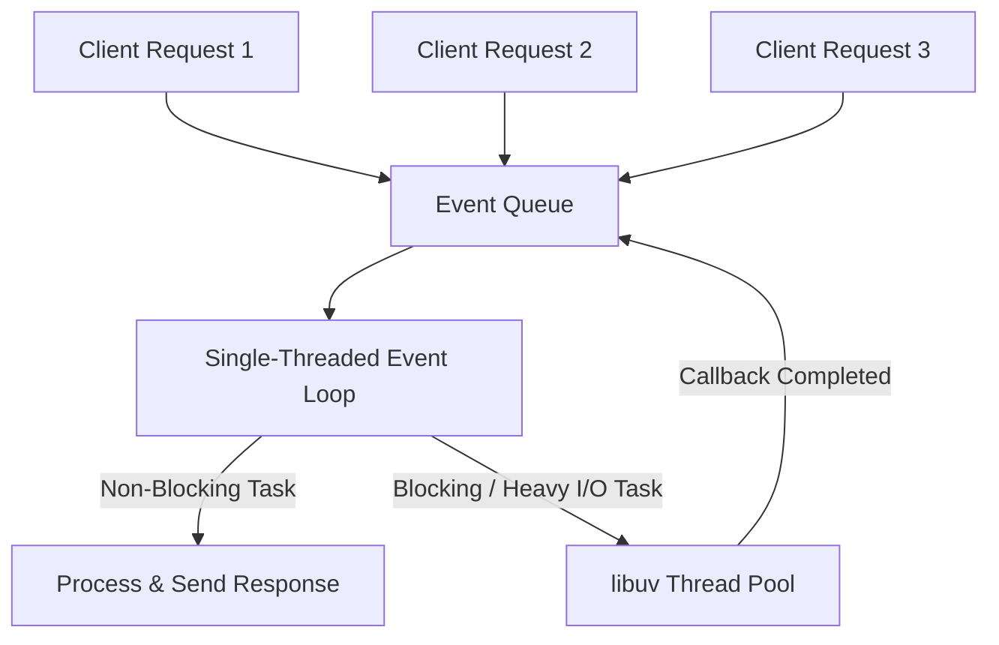

# Comprehensive Guide to Node.js (Intro to Node.js)

---

## 📌 Table of Contents
1. [What is Node.js?](#1-what-is-nodejs)
2. [Key Characteristics of Node.js](#2-key-characteristics-of-nodejs)
3. [Architecture & How Node.js Works](#3-architecture--how-nodejs-works)
   - [Understanding Threads](#understanding-threads)
   - [Single-Threaded Event Loop Model](#single-threaded-event-loop-model)
   - [Traditional Multi-Threaded vs. Node.js Architecture](#traditional-multi-threaded-vs-nodejs-architecture)
4. [Why Use Node.js?](#4-why-use-nodejs)
5. [Advantages of Node.js](#5-advantages-of-nodejs)
6. [Disadvantages of Node.js](#6-disadvantages-of-nodejs)
7. [When to Use and When NOT to Use Node.js](#7-when-to-use-and-when-not-to-use-nodejs)
8. [Installation & Setup Guide (Windows & Cross-Platform)](#8-installation--setup-guide-windows--cross-platform)
9. [First Node.js Application ("Hello World" Server)](#9-first-nodejs-application-hello-world-server)
10. [Summary & Key Takeaways](#10-summary--key-takeaways)

---

## 1. What is Node.js?

**Node.js** is an **open-source, cross-platform JavaScript runtime environment** that allows developers to execute JavaScript code **outside the web browser** (on the server-side).

> [!IMPORTANT]
> - **NOT a Programming Language**: Node.js uses JavaScript.
> - **NOT a Framework**: Node.js is a runtime environment (like JRE for Java).
> - **Built on V8 Engine**: It leverages Google Chrome's high-performance **V8 JavaScript Engine**, which compiles JavaScript code directly into native machine code for extremely fast execution.

```
+-------------------------------------------------------------+
|                         Node.js                             |
|  +---------------------------+  +------------------------+  |
|  |   V8 JavaScript Engine    |  |  libuv (C Library)     |  |
|  |  (Compiles JS to Machine) |  | (Async I/O & Threads)  |  |
|  +---------------------------+  +------------------------+  |
|  +-------------------------------------------------------+  |
|  |                Node.js Core C++ / JS API              |  |
|  +-------------------------------------------------------+  |
+-------------------------------------------------------------+
```

---

## 2. Key Characteristics of Node.js

1. **Open-Source Platform**: Free to use, maintained by the OpenJS Foundation and a massive global community.
2. **Server-Side Execution**: Enables JavaScript—traditionally limited to frontend browsers—to interact with operating systems, databases, filesystems, and networks.
3. **Asynchronous & Non-Blocking I/O**: Operations (like database queries or file reads) run in the background without halting execution.
4. **Single-Threaded Architecture**: Uses a single main thread backed by an event-driven mechanism to process thousands of concurrent connections efficiently.

---

## 3. Architecture & How Node.js Works

### Understanding Threads

- **What is a Thread?**  
  A **thread** is a sequence of CPU instructions executed independently. It represents a single execution path in a program.
  
- **Request/Response Lifecycle**:  
  In web servers, threads manage the sequence of steps required to send request data, process business logic, perform I/O, and receive/return responses.

---

### Single-Threaded Event Loop Model

Unlike traditional web servers (e.g., Apache) which spawn a new thread for every incoming client request, Node.js operates on a **Single-Threaded Event Loop Architecture**.



1. **Event Queue**: Incoming requests are queued as events.
2. **Event Loop**: The main thread continuously picks events from the queue.
3. **Non-Blocking Execution**: Fast, non-I/O tasks are executed directly on the main thread.
4. **libuv Thread Pool**: Heavy I/O operations (file processing, database queries, DNS lookups) are offloaded to a background C++ thread pool (`libuv`). Once completed, their callbacks are returned to the Event Queue.

---

### Traditional Multi-Threaded vs. Node.js Architecture

| Feature | Traditional Server (e.g., Apache / Java) | Node.js |
| :--- | :--- | :--- |
| **Threading Model** | Multi-threaded (Thread-per-request) | Single-threaded Event Loop |
| **I/O Model** | Synchronous & Blocking | Asynchronous & Non-blocking |
| **Memory Overhead** | High (Each thread consumes RAM) | Extremely Low |
| **Concurrency Limit** | Limited by CPU thread count and RAM | Can handle tens of thousands of concurrent requests |
| **Best Suited For** | CPU-intensive computations | I/O-bound, real-time, streaming applications |

---

## 4. Why Use Node.js?

There are many server-side languages (Java, Python, C#, PHP), so **what makes Node.js different?**

1. **Unified Language (JavaScript Everywhere)**:  
   Developers can write both frontend and backend code in JavaScript/TypeScript, reducing context switching and team overhead.
2. **Fast & Agile Prototyping**:  
   Minimal setup code makes it easy to build, iterate, and deploy MVP (Minimum Viable Product) applications rapidly.
3. **High Scalability**:  
   Built from the ground up for handling high-throughput, concurrent I/O operations with minimal hardware resources.
4. **Massive Ecosystem (npm)**:  
   Node Package Manager (npm) is the largest open-source package registry in the world, offering millions of reusable modules and libraries.
5. **Non-Blocking Asynchronous Nature**:  
   Prevents servers from idling while waiting for database or network responses.

---

## 5. Advantages of Node.js

### 1. 🚀 Easy Scalability
- **Horizontal Scaling**: Node.js applications can be easily scaled horizontally across multiple servers or processes using tools like the native `cluster` module, PM2, or Docker/Kubernetes.
- **Vertical Scaling**: Can easily utilize extra system hardware resources to handle higher loads.

### 2. ⚡ Real-Time Web Applications
- Node.js is the top choice for real-time applications (Chat apps, online gaming, collaborative editing tools, live notifications).
- Integrates seamlessly with **WebSockets** and **Socket.io**.
- The event loop prevents HTTP connection overhead and keeps synchronization fast.

### 3. 💨 Fast Execution ("Fast Suite")
- Powered by Google Chrome's **V8 engine**, which compiles JavaScript straight into native machine code.
- Operations like reading/writing to databases, network requests, and filesystem manipulation execute at blazing-fast speeds.

### 4. 🧠 Easy to Learn & Code
- Low learning curve for developers already familiar with JavaScript.
- Full-stack developers can manage both client and server logic.

### 5. 💾 Advantage of Caching
- **Module Caching**: Node.js automatically caches modules in memory after the first `require()` or `import` call.
- Subsequent calls to the module do not re-execute the code, significantly boosting performance and reducing CPU work.

### 6. 🌊 Data Streaming
- HTTP requests and responses are handled as **event-driven streams**.
- Allows applications to process data while it is still being uploaded or downloaded (e.g., video/audio streaming, file processing on the fly) without storing entire payloads in memory.

### 7. ☁️ Easy Hosting & Cloud Support
- Supported by major Cloud Providers and PaaS (Platform as a Service) platforms like AWS, Google Cloud, Azure, Vercel, Render, Heroku, and DigitalOcean.

### 8. 🏢 Massive Corporate Support
Node.js is trusted and heavily battle-tested in production by major global corporations:
- **PayPal**: Saw a 35% drop in average response times after switching to Node.js.
- **Netflix**: Reduced startup time from 40+ seconds to under 1 second.
- **Walmart, Uber, LinkedIn, eBay, Microsoft, Yahoo**.

---

## 6. Disadvantages of Node.js

While powerful, Node.js is not a silver bullet. Here are its limitations:

1. **Unsuitable for CPU-Intensive Tasks**:  
   Because Node.js runs on a single main thread, heavy computational tasks (like complex mathematical algorithms, image/video editing, AI/ML model inference) block the event loop, stalling all incoming requests.
   *(Note: Worker Threads (`worker_threads` module) help mitigate this, but it is still less ideal than multi-threaded languages like Java or C++ for pure heavy computing).*

2. **Callback Hell & Asynchronous Complexity**:  
   Deeply nested callback functions in complex async code can lead to unmaintainable and hard-to-debug code.  
   *(Solution: Use modern JavaScript features like `Promises` and `async/await`).*

3. **Unstable / Evolving API Dependencies**:  
   Core APIs receive updates, and third-party npm libraries can sometimes break backward compatibility or lack proper maintenance.

4. **Lack of Package Quality Control on npm**:  
   Anyone can publish packages to npm. Some libraries may be unmaintained, poorly documented, or contain security vulnerabilities.

---

## 7. When to Use and When NOT to Use Node.js

### ✅ Best Use Cases for Node.js
- **RESTful APIs & Microservices**
- **Real-Time Applications** (Chat platforms, live scoring, collaborative apps)
- **Single Page Applications (SPAs)**
- **Data Streaming Applications** (Media streaming services like Netflix)
- **I/O-Bound Applications** (DB heavy applications, Web Crawlers)

### ❌ When NOT to Use Node.js
- **Heavy CPU Computation** (Video encoding, graphics rendering, heavy data analysis)
- **Relational DB Heavy Legacy Enterprise Systems** requiring heavy synchronous transaction processing (where traditional Java or .NET stacks are deeply established).

---

## 8. Installation & Setup Guide (Windows & Cross-Platform)

Setting up the Node.js development environment can be done in multiple ways depending on your requirements.

### Method 1: Official Windows Pre-built Installer (.msi) - Recommended for Beginners
1. Go to the official website: [https://nodejs.org](https://nodejs.org).
2. Download the **LTS (Long Term Support)** version (Recommended for stability).
3. Run the `.msi` setup file and follow the installation wizard.
4. Ensure the checkbox **"Add to PATH"** is selected.

---

### Method 2: Node Version Manager (NVM) - Recommended for Developers
Using **`nvm-windows`** allows you to easily switch between multiple Node.js versions on a single machine.

1. Download `nvm-setup.exe` from the official repository: [nvm-windows GitHub](https://github.com/coreybutler/nvm-windows).
2. Install `nvm-windows`.
3. Open Terminal / PowerShell and run:
   ```bash
   nvm install lts
   nvm use lts
   ```

---

### Method 3: Other Installation Approaches
- **Package Managers**:
  - Windows (Chocolatey / Winget): `winget install OpenJS.NodeJS.LTS`
  - macOS (Homebrew): `brew install node`
  - Linux (Ubuntu/Debian): `sudo apt install nodejs npm`
- **Compiling Source Code**: Download Node.js source code from GitHub and build it using C++ compilers.
- **Cloning Git Repository**: Clone the Node.js Git repository and build locally across different OS environments.

---

### Verifying Installation
Open Command Prompt or PowerShell and verify Node.js and npm versions:

```bash
node -v
npm -v
```

---

## 9. First Node.js Application ("Hello World" Server)

Create a file named `app.js` and add the following code using Node.js's built-in `http` module:

```javascript
// app.js
const http = require('http');

const PORT = 3000;

const server = http.createServer((req, res) => {
    res.statusCode = 200;
    res.setHeader('Content-Type', 'text/plain');
    res.end('Hello, World! Welcome to Node.js backend development.\n');
});

server.listen(PORT, () => {
    console.log(`Server running at http://localhost:${PORT}/`);
});
```

### Running the Application:
Run the script in your terminal:

```bash
node app.js
```

Open your browser and navigate to `http://localhost:3000` to see your running Node.js server!

---

## 10. Summary & Key Takeaways

- Node.js is an **open-source, cross-platform runtime environment** built on Google Chrome's V8 engine.
- It uses a **single-threaded, event-driven, non-blocking I/O model**, making it lightweight and highly efficient.
- Ideal for **real-time web apps, REST APIs, streaming platforms, and microservices**.
- Core advantages include **easy scalability, fast execution, module caching, data streaming, and full-stack JS development**.
- Avoid Node.js for **CPU-intensive applications** (like complex calculations or video encoding) that block the single main thread.

---
*Document created for DSA & Backend Engineering Prep.*
